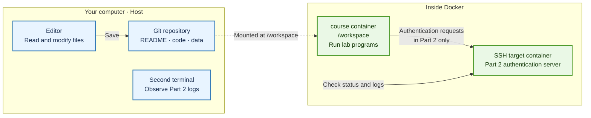
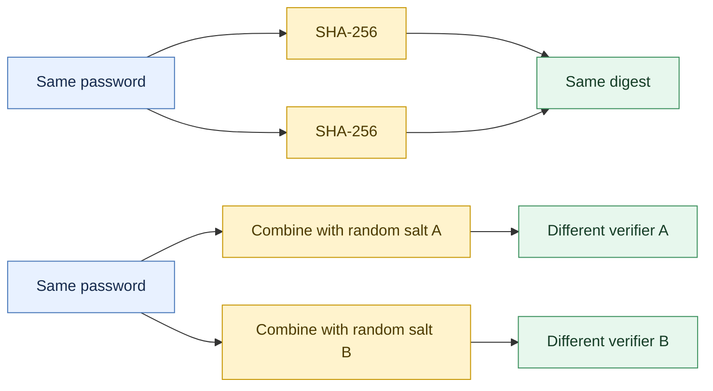
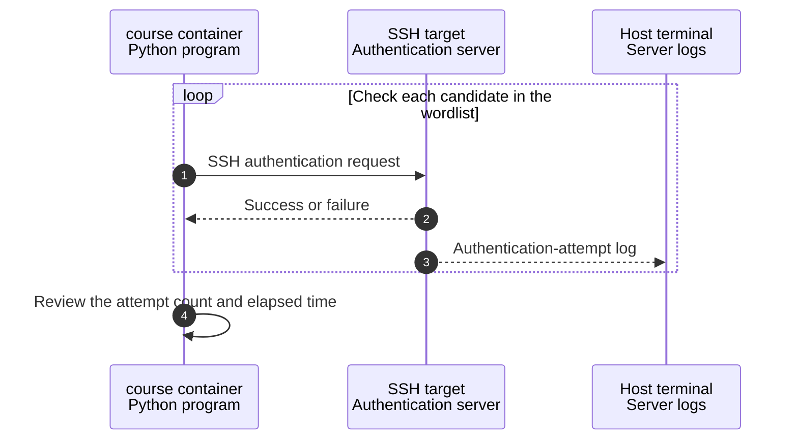
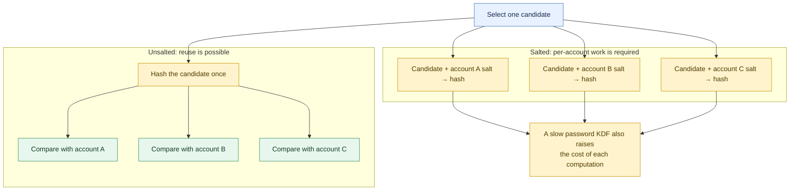
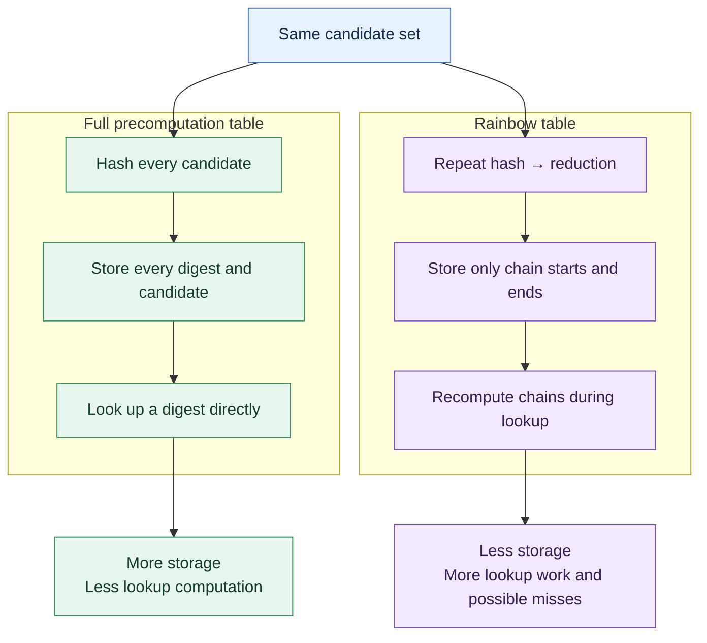
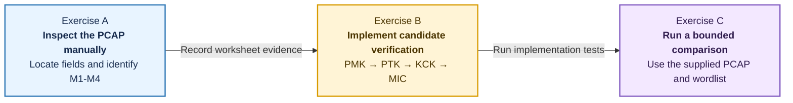
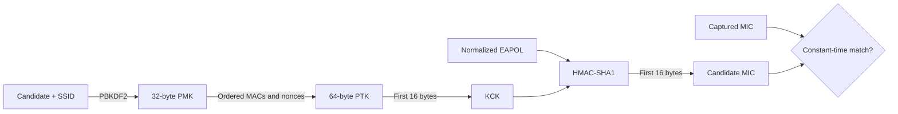
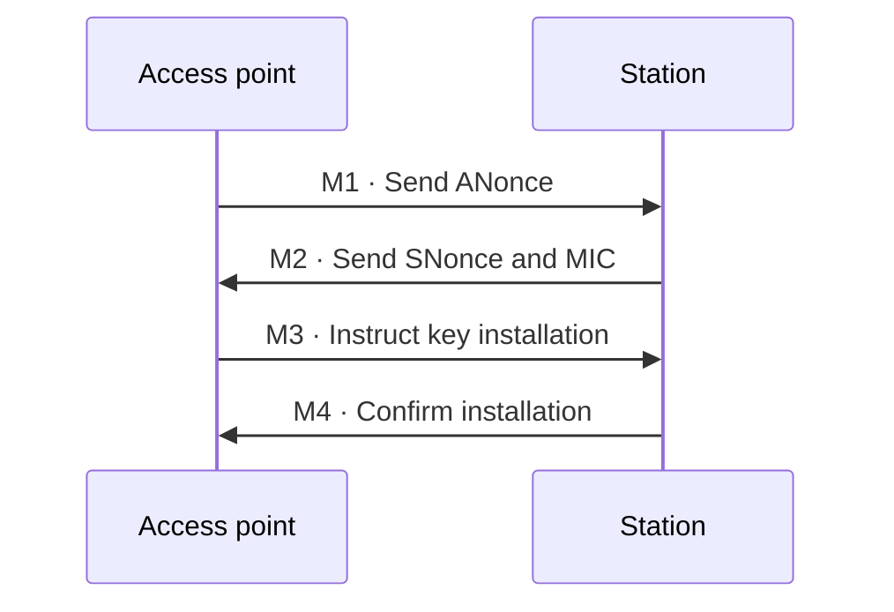

# Lab 01 at a Glance

Read this guide before starting Lab 01 to understand the **directory structure**,
**Docker environment**, and **purpose of each part**. Refer to the README in each
part for commands, implementation requirements, checkpoint questions, and report
requirements.

## 1. Learning Flow

Lab 01 explores how passwords and authentication data are stored and verified.

```mermaid
flowchart LR
    P1["Part 1<br/><b>Hashes and Salts</b><br/>Starting point for password storage"]
    P2["Part 2<br/><b>Online SSH Guessing</b><br/>Send candidates directly to a server"]
    P3["Part 3<br/><b>Offline Guessing and KDFs</b><br/>Check acquired verifiers locally"]
    P4["Part 4<br/><b>Table Attacks</b><br/>Reuse precomputed results"]
    P5["Part 5<br/><b>WPA2 Capture and Verification</b><br/>Inspect packets and implement an offline check"]

    P1 -->|Storage basics| P2
    P2 -->|Compare online and offline| P3
    P3 -->|Extend to precomputation| P4
    P4 -->|Apply to network authentication| P5

    classDef base fill:#e8f4ff,stroke:#337ab7,stroke-width:2px,color:#172b4d
    classDef online fill:#fff4d6,stroke:#d89b00,stroke-width:2px,color:#4a3400
    classDef offline fill:#f3e8ff,stroke:#845ec2,stroke-width:2px,color:#2f1b4d
    class P1 base
    class P2 online
    class P3,P4,P5 offline
```



- **Online guessing:** Each candidate is sent to a live authentication server. The
  server can observe, record, or limit the attempts.
- **Offline guessing:** Candidates are checked locally against an acquired verifier
  or capture file. No requests are sent to the authentication server.

## 2. Directories and Execution Environment

The lab materials are stored in one Git repository, while the programs run inside
Docker containers.

| Component | Role |
| --- | --- |
| Git repository on the host | Stores the README files, code, and data |
| `course` container | Provides the shared environment for Python and lab tools |
| `lab01-ssh-target` container | Provides the isolated SSH server used only in Part 2 |

The host repository is mounted at `/workspace` in the `course` container. A file
saved on the host is therefore immediately visible inside the container.



```text
labs/lab01/
├── README.md                       Official overview of Lab 01
├── STUDENT_WORKFLOW_GUIDE.md       This structural guide
├── data/                           Lab data shared by the parts
├── part1_hashing/                  Hashes and salts
├── part2_dictionary_attack/        Online SSH guessing
├── part3_password_kdfs/            Offline guessing and KDFs
├── part4_system_hashes/            System verifiers and table attacks
├── part5_wpa2/                     WPA2 capture verification
└── report/                         Report materials
```

The README in each `part.../` directory gives the instructions and submission
criteria for that part.

## 3. Part 1: Hashes and Salts

Part 1 introduces the basic idea of transforming a password into a verifier instead
of storing the password itself.



Without a salt, the same password produces the same digest. With a random salt,
the same password produces different verifiers.

## 4. Part 2: Online SSH Guessing in an Isolated Environment

Part 2 demonstrates that **online guessing requires communication with a server for
every candidate**. This is the only part that uses both the `course` container and
the SSH target container.



The Python program initiates the experiment, and the SSH target receives its
requests. The log terminal is an observation window for the existing target, not a
second server.

## 5. Part 3: Offline Guessing and Password KDFs

Part 3 examines how salts affect an attacker's workload and why a password KDF
slows candidate testing.



A salt requires separate computation for each account. A password KDF also makes
each computation slower, increasing the cost of testing many candidates.

## 6. Part 4: System Verifiers and Table Attacks

Part 4 has two goals:

- Identify the algorithm, parameters, salt, and verifier in a system hash string.
- Compare storage and lookup costs when an attacker saves precomputed results.



A full precomputation table stores more results to reduce lookup work. A rainbow
table stores only the start and end of each chain, saving space at the cost of
recomputing chains during lookup. A reduction function is not the inverse of a
hash; it maps a digest back into the candidate space.

## 7. Part 5: WPA2 Capture and Offline Verification

Part 5 begins with manual packet inspection and then connects the observed WPA2
fields to a candidate-verification implementation.

| Material | Purpose |
| --- | --- |
| PCAP | Manually locate the network and M1-M4 fields with Wireshark or TShark |
| `CAPTURE_WORKSHEET.md` | Record packet evidence without an automated parser |
| Synthetic JSON | Provide a separate, reproducible calculation fixture |
| Python starter and tests | Implement and verify the PMK-to-MIC pipeline |







The PCAP and synthetic JSON are separate classroom datasets. Candidate
verification uses local values and sends no new authentication request to the
access point.

## 8. Where to Go Next

After you understand the overall structure, read `labs/lab01/README.md` for the lab
sequence and then open the README for the part you are working on. Follow that
README for commands, code requirements, tests, checkpoints, and report criteria.
