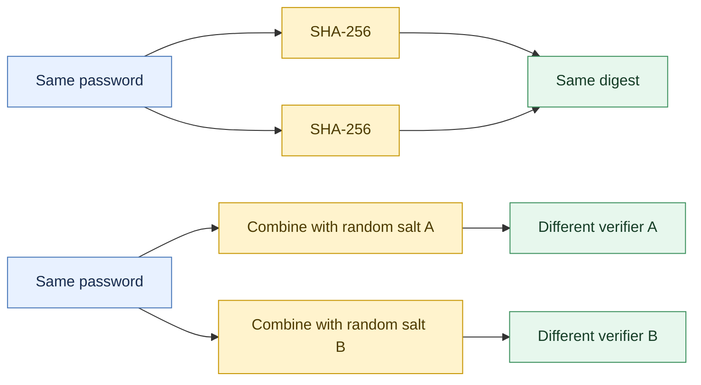

# Part 1: Hash and salt

**Ethical and authorized use:** enter only fictional passwords made for this
lab. Never place a real password in source code, shell history, or screenshots.

Run `python3 hash_password.py` twice with the same input, then run
`python3 salted_hash.py` twice. SHA-256 is one-way hashing, not encryption:
there is no decryption key. Observe that unsalted digests repeat, while random
salts change the demonstration verifier.

These constructions teach mechanics only. Neither raw SHA-256 nor
`SHA256(salt || password)` is appropriate production password storage.

## Part 1 at a glance



## Purpose and learning objectives

This part introduces the value a server can compare during login without
keeping a plaintext password. It deliberately starts with fast SHA-256 so that
the basic transformation is easy to observe. Part 3 later replaces this unsafe
baseline with dedicated password KDFs.

After completing this part, you should be able to:

- describe the difference between plaintext storage, encryption, and hashing;
- encode a Python string as UTF-8 before hashing it;
- explain why the same unsalted input always has the same digest;
- explain why a random, unique salt changes the verifier; and
- state why salt plus fast SHA-256 is still not production password storage.

## Background

During registration, a service computes a verifier from a password and stores
the verifier. During login, it repeats the computation with the submitted
password and compares the results. Hashing is one-way: unlike encryption, it
does not have a decryption key that recovers the original password.

```text
Unsalted demonstration:
UTF8(password) -> SHA-256 -> 32-byte digest -> 64 hexadecimal characters

Salted demonstration:
random 16-byte salt || UTF8(password) -> SHA-256 -> digest
store: salt + digest
```

The salt is public. Its job is to make identical passwords produce different
stored values and to prevent one precomputed table from serving every account.
It does not add entropy to a weak password and does not slow down each guess.

## Tasks

1. Run `hash_password.py` twice with the same fictional input and save both
   digests.
2. Run it once with a different input and compare the digest.
3. Run `salted_hash.py` twice with the original fictional input and save both
   salt/digest pairs.
4. Identify which values remain equal and which change.
5. Run `test_hashing.py` and explain what each assertion demonstrates.
6. Record your observations and checkpoint answers in the lab report.

## Python files and usage examples

Start in this directory inside the course container:

```console
cd /workspace/labs/lab01/part1_hashing
```

### `hash_password.py`

Hash the same fictional password twice. `getpass` deliberately does not
display the password while you type it.

```console
python3 hash_password.py
Educational demo only; SHA-256 alone is unsafe for password storage.
Password:
<64 hexadecimal characters>
```

Run the command again with the same input. The two digests should be identical
because SHA-256 is deterministic.

### `salted_hash.py`

Run the salted demonstration twice with the same fictional password:

```console
python3 salted_hash.py
Password:
salt=<32 hexadecimal characters>
digest=<64 hexadecimal characters>
Educational demo only; use a password KDF in production.
```

The salt and digest should normally change on every run. The salt is stored
alongside the verifier; it is unique, not secret.

### `test_hashing.py`

This file checks that plain hashing is deterministic and that two fixed salts
produce different demonstration verifiers. Run it through pytest:

```console
pytest -q test_hashing.py
```

Expected result: `2 passed`.

To run just one test function while debugging, use:

```console
pytest -q test_hashing.py::test_salts_change_digest
```

## Completion criteria and report evidence

You have completed Part 1 when:

- the same password produces the same unsalted digest twice;
- the same password with two generated salts produces different digests;
- both tests pass; and
- you can explain why the salt must be stored with the verifier.

Include the commands, redacted or fictional inputs, resulting digests, test
output, and a short comparison of hashing and encryption in your report.

## Checkpoint questions

1. Why is encryption, whose design permits decryption, the wrong default model
   for password verification?
2. Why do identical inputs produce identical unsalted SHA-256 digests?
3. What does a unique salt change, and what does it not prevent?
