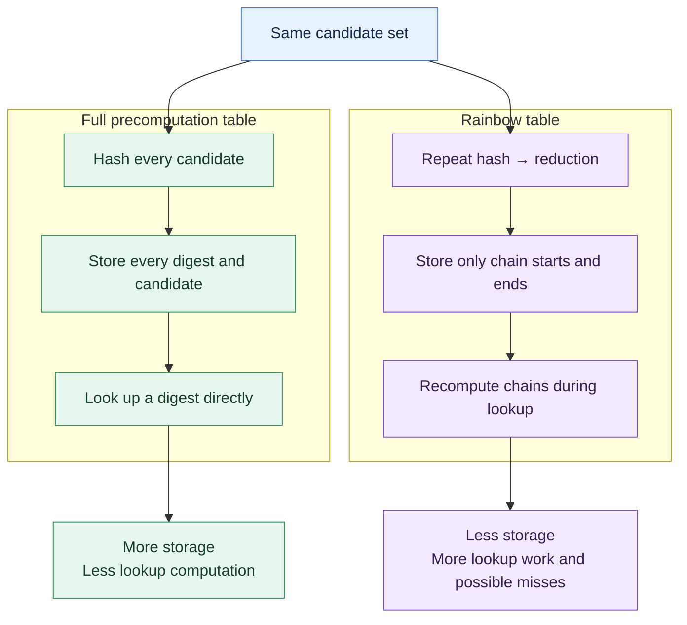

# Part 4: System hashes and table attacks

**Estimated time:** 35 minutes. **Environment:** course Docker container.

**Ethical and authorized use:** use only the fictional records in `../data`.
The exercises never read `/etc/shadow` and never contact an authentication
service. Do not obtain or test another person's password database.

This part first examines a Linux shadow-style verifier. It then uses a separate,
tiny SHA-256 password database to compare a full precomputation table with a
rainbow-table-like endpoint structure. The password space is deliberately only
`6^4 = 1,296` candidates so that every step can be inspected in class. These
parameters are for learning and provide no real security.

## Part 4 at a glance



## Learning objectives

After completing this part, you should be able to:

- parse the algorithm, salt, and verifier fields in a shadow-style record;
- distinguish parsing a verifier from guessing its password;
- explain how work performed before a target is known can accelerate later
  offline guessing;
- implement a full digest-to-password precomputation table;
- implement column-specific reduction and hash/reduction chains;
- reconstruct chains to look up targets using only stored starts and endpoints;
- compare build work, stored entries, file size, lookup work, and coverage; and
- explain why a unique salt prevents one unsalted table from being reused for
  many accounts.

## Exercise A: inspect a system password record

### Background

A simplified shadow-style line has this shape:

```text
account:$id$salt-or-parameters$verifier:password-change fields...
```

The account name is not secret. The identifier selects the password-hashing
scheme, and the salt and parameters must be stored so that a legitimate login
can recompute the verifier. The verifier is a derived value, not encrypted
plaintext. The remaining colon-separated fields describe password-aging policy.

### Tasks

1. Display `../data/linux_hashes.txt` and identify its colon-separated fields.
2. Run `analyze_shadow_hash.py` and map its dictionary output back to the line.
3. Explain why parsing needs no candidate password and performs no guesses.
4. Classify a local wordlist check against a copied verifier as online or
   offline. The optional John command below may be used only on the supplied
   synthetic file.

### Commands and expected results

1. **Parse the supplied record**

   ```console
   cd /workspace/labs/lab01/part4_system_hashes
   python3 analyze_shadow_hash.py ../data/linux_hashes.txt
   ```

   Expected output has this structure:

   ```text
   {'account': 'student_...', 'id': '6', 'algorithm': 'SHA-512-crypt',
    'salt_or_parameters': '...', 'verifier': '...'}
   ```

   The `$6$` identifier selects SHA-512-crypt. The script accepts an explicit local
   filename and never opens `/etc/shadow` automatically.

2. **Inspect the interface and optional John output**

   ```console
   python3 analyze_shadow_hash.py --help
   john --wordlist=../data/lab01-small.txt ../data/linux_hashes.txt
   john --show ../data/linux_hashes.txt
   ```

   Runtime and exact John status messages can vary. The key observation is that
   all guesses are checked locally, so a login service cannot rate-limit them.

## Exercise B: compare precomputation and rainbow tables

### Background

The supplied `rainbow_password_database.csv` contains fictional accounts and
unsalted SHA-256 digests. A **full precomputation table** stores one
`digest -> password` entry for every candidate in the toy space. It uses more
memory, but a target lookup is a dictionary operation and needs no new hashes.

A **rainbow table** walks chains of alternating operations:

```text
password --H--> digest --R_0--> password --H--> digest --R_1--> ...
```

`H` is SHA-256. A reduction function `R_i` maps a large digest back into the
small password space; it does not invert SHA-256. The column number makes each
reduction different. The table stores only each chain's start and endpoint.
During lookup, the omitted middle of a possible chain must be recomputed.

This exchanges memory for target-time lookup work. It also loses coverage when
chains merge or when a password is not visited by any chain. Therefore a small
rainbow table is not expected to recover every database row.

### Supplied configuration and data

`../data/rainbow_lab_config.json` defines:

| Parameter | Classroom value | Meaning |
| --- | ---: | --- |
| Algorithm | SHA-256 | Fast hash used only for the toy experiment |
| Alphabet | `abc123` | Six allowed characters |
| Password length | 4 | Exactly four characters |
| Password space | 1,296 | `6^4` possible passwords |
| Chain length | 12 | Hash/reduction steps per chain |
| Chain starts | 96 | Deterministically selected using seed 2026 |

Keep these bounded parameters unchanged for the required experiment. Generated
tables belong in `generated/`, which Git ignores.

### Implementation tasks

1. In `build_precomputation_table.py`, implement `build_table()` by enumerating
   `password_space()` and hashing every candidate exactly once.
2. In `build_rainbow_table.py`, implement `reduce_digest()`,
   `chain_endpoint()`, and `build_table()`. Store all starts that share an
   endpoint so that chain merges are visible rather than overwritten.
3. In `compare_table_attacks.py`, implement `lookup_precomputation()` and
   `lookup_rainbow()`. Rainbow lookup must try possible target columns,
   calculate a possible endpoint, replay matching chains from their starts, and
   verify the original target digest before returning a candidate.
4. Generate both tables, attack the same supplied database with each, and
   record the comparison metrics.
5. Complete the salt-reuse observation and answer the checkpoint questions.

Do not add the target hashes or their recovered passwords as special cases.
Your implementation must work from the configuration, table, and database.

### Commands and expected results

1. **Inspect the configured password space with `table_common.py`**

   This is a support module rather than a command-line program. The following
   example checks the configured space without revealing a database password:

   ```console
   python3 -c "from pathlib import Path; from table_common import load_config, password_space; c=load_config(Path('../data/rainbow_lab_config.json')); print(sum(1 for _ in password_space(str(c['alphabet']), int(c['password_length']))))"
   ```

   Expected result:

   ```text
   1296
   ```

2. **Run the baseline tests**

   Before implementing the TODOs, run the basic fixture tests. Implementation
   tests are skipped:

   ```console
   python3 -m unittest test_table_attacks.py -v
   ```

3. **Build the full table with `build_precomputation_table.py`**

   After implementing its TODO:

   ```console
   mkdir -p generated
   python3 build_precomputation_table.py \
     ../data/rainbow_lab_config.json generated/precomputation.json
   ```

   The script reports 1,296 entries and build hashes, plus build time and JSON file
   size. Inspect a few keys and values, but do not paste recovered passwords into
   a public report.

4. **Build the rainbow table with `build_rainbow_table.py`**

   After implementing its TODOs:

   ```console
   python3 build_rainbow_table.py \
     ../data/rainbow_lab_config.json generated/rainbow.json
   ```

   The script reports 96 starts, 1,152 build hashes, and no more than 96 distinct
   endpoints. Fewer endpoints than starts demonstrates that at least two chains
   merged.

5. **Compare both methods with `compare_table_attacks.py`**

   After both tables and lookup functions are complete:

   ```console
   python3 compare_table_attacks.py \
     ../data/rainbow_password_database.csv \
     generated/precomputation.json generated/rainbow.json
   ```

   The output contains one summary row per method:

   ```text
   method      recovered build hashes  build sec  records  endpoints ...
   full             ...          1296        ...     1296          - ...
   rainbow          ...          1152        ...       96        ... ...
   ```

   The full table should recover every supplied target. The smaller rainbow table
   should demonstrate partial coverage and additional lookup hashes. Exact times
   and serialized file sizes depend on the environment.

6. **Run the implementation tests**

   After completing all TODOs, enable the implementation checks:

   ```console
   LAB01_GRADE=1 python3 -m unittest test_table_attacks.py -v
   ```

7. **Observe salt reuse**

   Use a non-target classroom example to see that changing the input changes the
   lookup key:

   ```console
   python3 -c "import hashlib,json; t=json.load(open('generated/precomputation.json'))['entries']; p=b'abc1'; print(hashlib.sha256(p).hexdigest() in t, hashlib.sha256(b'public-salt:'+p).hexdigest() in t)"
   ```

   The unsalted digest is present and the salted digest is absent. A real password
   database stores each salt openly and hashes with a password KDF, but an attacker
   must then perform work for each distinct salt. One shared unsalted
   precomputation or rainbow table is no longer directly reusable across accounts.

### Comparison table for your report

Fill this in from your own run:

| Method | Build hashes | Stored records | Distinct endpoints | JSON bytes | Targets recovered | Lookup hashes | Lookup seconds |
| --- | ---: | ---: | ---: | ---: | ---: | ---: | ---: |
| Full precomputation | | | N/A | | | | |
| Rainbow endpoints | | | | | | | |

For build hashes, use the construction performed by your code: one per toy
candidate for the full table, and `chain starts × chain length` for the rainbow
table. Discuss both the measured JSON size and the conceptual number of stored
password/digest or start/endpoint values; JSON metadata adds overhead.

## Completion criteria

You have completed Part 4 when:

- the system-hash parser identifies the fictional account, algorithm, salt, and
  verifier without reading `/etc/shadow`;
- both generated JSON tables have the documented type and configuration;
- all enabled tests pass;
- both methods run against the same supplied database;
- your report compares storage, build work, lookup work, and coverage without
  publishing recovered passwords; and
- you explain why salts prevent reuse of these unsalted tables.

## Checkpoint questions

1. Which fields in the shadow-style record are required to verify a login, and
   why is the verifier not encrypted plaintext?
2. Which steps in this part are parsing, precomputation, and offline guessing?
3. What is the reduction function's purpose, and why is it not an inverse hash?
4. Why does a rainbow lookup perform new hashes while a full-table lookup does
   not?
5. Why can two starts produce the same endpoint, and how does that affect
   coverage?
6. Which measured resource did the rainbow table save, and what costs or
   limitations did it introduce?
7. Why would a unique salt require separate precomputation for each account?
