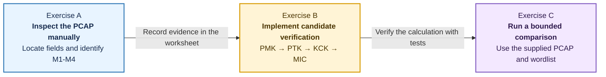
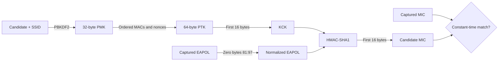

# Part 5: WPA2 offline candidate verification

**Estimated time:** 40 minutes.

**Ethical and authorized use:** use only the supplied course PCAP and synthetic
metadata. Do not capture traffic, deauthenticate clients, disrupt networks, use
a wireless interface, or test third-party credentials. This exercise begins
after an authorized capture has already been provided.

In this part, packet observations are deliberately **not extracted by a Python
script**. You must inspect the saved PCAP with Wireshark or TShark, find the
relevant fields in the decoded protocol tree, and record your own observations.
You will then implement the WPA2 candidate-verification calculations in Python.

## Part 5 at a glance



## Learning objectives

After completing this part, you should be able to:

- locate the SSID and BSSID in an 802.11 management frame;
- identify the AP and station addresses in EAPOL-Key frames;
- distinguish M1, M2, M3, and M4 using direction, flags, and replay counters;
- locate nonces and a MIC in the Wireshark protocol tree;
- implement WPA2-Personal PMK, PTK, KCK, and MIC calculations;
- explain why a recorded handshake permits offline candidate verification; and
- state the authorization boundary for wireless-security experiments.

## Files used

| File | Purpose |
| --- | --- |
| `../data/wpa2/lab01-handshake.pcap` | Instructor-provided classroom capture |
| `../data/wpa2/lab01-pcap-wordlist.txt` | Small candidate list for that PCAP only |
| `CAPTURE_WORKSHEET.md` | Blank table for your manual packet observations |
| `../data/wpa2_capture.json` | Separate synthetic Python calculation fixture |
| `../data/lab01-small.txt` | Candidate list for the synthetic JSON fixture |
| `explain_handshake.py` | Prints the fields in the synthetic JSON fixture |
| `verify_candidate.py` | Starter containing the PMK-to-MIC TODO pipeline |
| `test_wpa2_workflow.py` | Baseline and opt-in implementation tests |

The PCAP and `wpa2_capture.json` are two separate, intentionally created
classroom datasets. Do not expect their SSIDs, addresses, nonces, or MICs to be
the same. The PCAP is for manual protocol inspection and the bounded
aircrack-ng comparison. The JSON fixture gives your Python functions a compact,
reproducible input after you have learned where those values appear in a real
packet trace.

The SSID and endpoint MAC addresses embedded in the distributed PCAP are
fictional course identifiers. They are intentionally left out of this guide so
that finding them remains part of Exercise A.

## Setup

TShark, Wireshark's command-line packet analyzer, is installed in the course
image. If your image was built before this Part 5 update, rebuild it from the
repository root:

```console
docker compose -f docker/compose.yml build
docker compose -f docker/compose.yml run --rm course bash
```

Inside the container, verify the tool and move to Part 5:

```console
tshark --version
cd /workspace/labs/lab01/part5_wpa2
```

The Compose configuration does not forward a graphical desktop from the
container. You may optionally open the same repository PCAP with a Wireshark
GUI installed on the host. TShark is the supported container-only path, so a
host Wireshark installation is not required.

## Exercise A: inspect the PCAP manually

Do not write or use a Python parser for this exercise. Do not use a TShark
`-T fields` command that prints a ready-made answer table. Read the decoded
packet tree and enter your findings in `CAPTURE_WORKSHEET.md`.

1. **Choose an inspection tool**

   #### Option 1: Wireshark GUI on the host

   1. Choose **File > Open** and select
      `labs/lab01/data/wpa2/lab01-handshake.pcap` from this repository.
   2. Enter the following display filter to show the authentication key exchange:

      ```text
      eapol
      ```

   3. Inspect the four displayed frames. In the 802.11 header, find the BSSID that
      is common to the exchange, then distinguish the AP from the other
      station/client address using frame direction and the Key ACK flag.
   4. Replace `RECORDED_BSSID` below with the BSSID you just observed. This limits
      the many beacon frames in the PCAP to the relevant access point:

      ```text
      wlan.fc.type_subtype == 0x0008 && wlan.bssid == RECORDED_BSSID
      ```

   5. Select the resulting beacon and expand **IEEE 802.11 wireless LAN management
      frame**. Confirm the BSSID in the 802.11 header. Expand **Tagged parameters**
      and the **SSID parameter set** to find the network name.
   6. Return to the `eapol` filter. In each frame, record the receiver,
      transmitter, and BSSID. Under **802.1X Authentication** and **WPA Key Data**
      (wording can vary by Wireshark version), locate the replay counter, nonce,
      key MIC, and Key Information flags.
   7. Use the message-identification table below to label each frame M1-M4. Record
      frame numbers rather than relying only on their displayed order.

   #### Option 2: TShark inside the course container

   First view the packet list so you understand the trace layout:

   ```console
   tshark -n -r ../data/wpa2/lab01-handshake.pcap
   ```

   Display the full decoded protocol tree for the EAPOL-Key frames first:

   ```console
   tshark \
     -n \
     -r ../data/wpa2/lab01-handshake.pcap \
     -Y 'eapol' \
     -V
   ```

   Read the receiver, transmitter, BSSID, replay counter, nonce, key MIC, and Key
   Information flags. Identify the BSSID shared by the four frames. Enter that
   value when prompted, then inspect only the relevant beacon:

   ```console
   read -r -p "Enter the BSSID from your worksheet: " AP_BSSID
   tshark \
     -n \
     -r ../data/wpa2/lab01-handshake.pcap \
     -Y "wlan.fc.type_subtype == 0x0008 && wlan.bssid == ${AP_BSSID}" \
     -V
   ```

   Read the 802.11 header and tagged parameters to locate the SSID. The verbose
   output is long by design: locating fields in a protocol tree is part of the
   exercise.

2. **Identify M1-M4**

   Use the AP/STA direction and these EAPOL-Key flags. A set bit is shown as `1`.

   ```mermaid
   sequenceDiagram
       participant AP as Access point
       participant STA as Station
       AP->>STA: M1 · ANonce · ACK=1 · MIC=0 · Secure=0
       STA->>AP: M2 · SNonce · ACK=0 · MIC=1 · Secure=0
       AP->>STA: M3 · Install keys · ACK=1 · MIC=1 · Secure=1
       STA->>AP: M4 · Acknowledge · ACK=0 · MIC=1 · Secure=1
   ```

   | Message | Direction | Key ACK | Key MIC | Secure | Main observation |
   | --- | --- | ---: | ---: | ---: | --- |
   | M1 | AP -> STA | 1 | 0 | 0 | AP supplies ANonce |
   | M2 | STA -> AP | 0 | 1 | 0 | STA supplies SNonce and MIC |
   | M3 | AP -> STA | 1 | 1 | 1 | AP authenticates key installation |
   | M4 | STA -> AP | 0 | 1 | 1 | STA acknowledges installation |

   Wireshark may display additional Key Information bits. Use only the direction,
   three bits above, replay counter, and nonce behavior for this simplified
   classification. If your four rows do not form a coherent exchange, recheck the
   addresses and frame numbers before continuing.

3. **Complete the capture worksheet**

   Complete the worksheet without consulting an automated parser:

   1. Which beacon-frame field contains the SSID? Which header field contains the
      BSSID?
   2. Which address belongs to the AP, and which belongs to the station?
   3. Which frames are M1, M2, M3, and M4? Give evidence from direction and flags.
   4. In which messages do ANonce and SNonce first appear?
   5. How do the replay counters group the request/response pairs?
   6. Which messages contain a nonzero MIC, and why does M1 differ?

   Do not put the recovered passphrase in the worksheet, report, or screenshots.

## Exercise B: implement candidate verification

### Background: PMK, PTK, KCK, and MIC

The password is not transmitted in the four-way handshake. For WPA2-Personal,
a candidate and SSID produce the **Pairwise Master Key (PMK)**:

```text
PMK = PBKDF2-HMAC-SHA1(
    password = UTF-8(passphrase),
    salt = UTF-8(SSID),
    iterations = 4096,
    output length = 32 bytes
)
```

The two peers order their raw address and nonce byte strings identically:

```text
context = min(AP_MAC, STA_MAC) || max(AP_MAC, STA_MAC)
        || min(ANonce, SNonce) || max(ANonce, SNonce)
```

Two 6-byte MAC addresses and two 32-byte nonces produce a 76-byte context. The
PMK and context are expanded into a 64-byte **Pairwise Transient Key (PTK)**:

```text
block[i] = HMAC-SHA1(
    key = PMK,
    data = "Pairwise key expansion" || 0x00 || context || BYTE(i)
)

PTK = first 64 bytes of (block[0] || block[1] || ...)
```

Start the one-byte counter at zero. The first 16 PTK bytes are the **Key
Confirmation Key (KCK)** used to authenticate EAPOL-Key data with a MIC. Other
PTK sections include the KEK and TK, which are not calculated separately here.

For candidate verification, the captured MIC field in the EAPOL bytes is first
replaced with zeros. A candidate MIC is then computed with HMAC-SHA1 and
truncated to 16 bytes:

```text
candidate + SSID -> PMK
PMK + ordered addresses/nonces -> PTK -> first 16 bytes -> KCK
KCK + normalized EAPOL -> candidate MIC -> constant-time comparison
```



A matching MIC is evidence that the candidate generated the same key material.
All inputs needed to test another candidate are already local, so no guess is
sent to the access point and server-side rate limiting cannot observe it.

### Implementation tasks

Complete these TODOs in `verify_candidate.py` in order:

1. `derive_pmk()` - encode the candidate and SSID as UTF-8, then use the PMK
   parameters above. Return exactly 32 bytes.
2. `build_context()` - decode the four hexadecimal JSON fields, sort the MACs
   and nonces independently as byte strings, and return the 76-byte context.
3. `derive_ptk()` - append HMAC-SHA1 PRF blocks for counters 0, 1, and so on,
   then truncate the accumulated result to 64 bytes.
4. `derive_kck()` - return the first 16 bytes of the PTK.
5. `normalized_eapol()` - decode the EAPOL hex, reject truncated input, and
   replace the 16-byte Python slice `81:97` with zeros.
6. `compute_mic()` - calculate HMAC-SHA1 over normalized EAPOL and retain the
   first 16 bytes.
7. `verify()` - connect the functions, decode the captured MIC, compare with
   `hmac.compare_digest`, and return only `True` or `False`.

The constants, command-line interface, and local JSON loading are supplied.
The starter raises `NotImplementedError` until you complete each TODO.

### Commands and tests

1. **Understand the synthetic input**

   After completing the manual PCAP work, inspect the separate calculation fixture:

   ```console
   python3 explain_handshake.py ../data/wpa2_capture.json
   ```

   This program reads JSON; it does not parse the PCAP or answer Exercise A. Match
   the printed field names to the fields you located manually in Wireshark/TShark.

   To view its argument syntax:

   ```console
   python3 explain_handshake.py --help
   ```

2. **Run the baseline tests**

   Before implementing the TODOs, run the baseline data checks. Completion tests
   will be skipped intentionally:

   ```console
   python3 -m unittest test_wpa2_workflow.py -v
   ```

3. **Run the implementation tests**

   After implementing every TODO, enable all implementation checks:

   ```console
   LAB01_GRADE=1 python3 -m unittest test_wpa2_workflow.py -v
   ```

   The tests check output lengths, address/nonce ordering, sensitivity to changed
   inputs, truncated EAPOL rejection, MIC normalization, and exactly one match in
   `../data/lab01-small.txt`. They do not print the matching candidate or
   reference digests.

4. **Check one candidate**

   The candidate is read with `getpass`, so it is not displayed or stored in shell
   history. Choose one candidate from `../data/lab01-small.txt`. This step checks
   the command-line interface, so `no match` is a valid result; you do not need
   to discover the matching candidate manually. The implementation tests above
   confirm that the supplied list contains exactly one match without printing it.

   ```console
   python3 verify_candidate.py ../data/wpa2_capture.json
   Candidate:
   no match
   ```

   A consistent candidate prints `match`; another input prints `no match`. The
   script accepts only a local metadata file and performs no network operation.

   ```console
   python3 verify_candidate.py --help
   ```

## Exercise C: bounded dictionary comparison

1. **Run the bounded comparison**

   Move to the directory containing the supplied PCAP and wordlist:

   ```console
   cd /workspace/labs/lab01/data/wpa2
   ```

   Enter the BSSID you recorded manually in `CAPTURE_WORKSHEET.md`, then run
   the bounded comparison:

   ```console
   read -r -p "Enter the BSSID from your worksheet: " AP_BSSID
   aircrack-ng -w lab01-pcap-wordlist.txt -b "${AP_BSSID}" lab01-handshake.pcap
   ```

   Use only the two supplied course files. Record the tested-key count and elapsed
   time, but do not publish the recovered key. Do not substitute a downloaded
   wordlist or another capture.

2. **Compare the offline processes**

   Compare the tool's offline process with your Python pipeline. In both cases, a
   candidate is used to derive key material and reproduce captured authentication
   data; it is not submitted to an access point.

## Completion criteria

Part 5 is complete when:

- `CAPTURE_WORKSHEET.md` contains your manually observed fields and M1-M4
  evidence;
- every TODO in `verify_candidate.py` is implemented;
- all opt-in tests pass with `LAB01_GRADE=1`;
- the bounded PCAP check completes without revealing its key in your report;
- you can explain every step from passphrase to MIC; and
- you can explain why this is an authorized offline exercise.

## Checkpoint questions

1. Where did you find the SSID, BSSID, station address, nonce, and MIC?
2. What direction and flags distinguish each handshake message?
3. Which captured values make candidate verification possible?
4. Why does changing the SSID change the PMK?
5. Why must both peers sort MAC addresses and nonces in the same way?
6. Why must the captured MIC field be zeroed before MIC recomputation?
7. Why can server-side rate limiting not slow this computation?
8. Why should these observations not be generalized directly to
   WPA2-Enterprise or WPA3-SAE?
